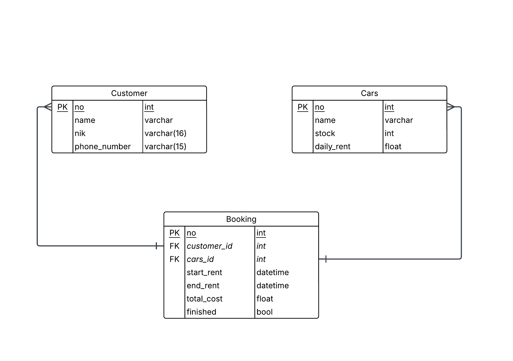

# Car Rental API

A Go-based car rental management system API built using Gin framework.

## Database Schema (ERD)



### Database Entities

#### Customer Table
- **no** (PK) - `int` - Primary key, unique customer identifier
- **name** - `varchar` - Customer's full name
- **nik** - `varchar(16)` - National identification number (16 characters)
- **phone_number** - `varchar(15)` - Customer's contact phone number

#### Cars Table
- **no** (PK) - `int` - Primary key, unique car identifier
- **name** - `varchar` - Car model/name
- **stock** - `int` - Number of available cars of this model
- **daily_rent** - `float` - Daily rental price

#### Booking Table
- **no** (PK) - `int` - Primary key, unique booking identifier
- **customer_id** (FK) - `int` - Foreign key referencing Customer.no
- **cars_id** (FK) - `int` - Foreign key referencing Cars.no
- **start_rent** - `datetime` - Rental start date and time
- **end_rent** - `datetime` - Rental end date and time
- **total_cost** - `float` - Total calculated cost for the rental period
- **finished** - `bool` - Flag indicating if the rental is completed

### Relationships

1. **Customer → Booking**: One-to-Many
   - A customer can have multiple bookings
   - Each booking belongs to one customer

2. **Cars → Booking**: One-to-Many
   - A car model can be booked multiple times
   - Each booking is for one specific car model

## Project Structure

```
car-rental/
├── cmd/
│   └── main.go              # App entry point
├── pkg/
│   ├── database/            # Database connection and configuration
│   ├── handlers/            # HTTP request handlers
│   ├── models/              # Data models (Customer, Car, Booking)
│   └── routes/              # API route definitions
├── docs/
│   └── erd-v1.jpeg
├── go.mod                   # Go module dependencies
├── go.sum                   # Dependency checksums
└── README.md 
```