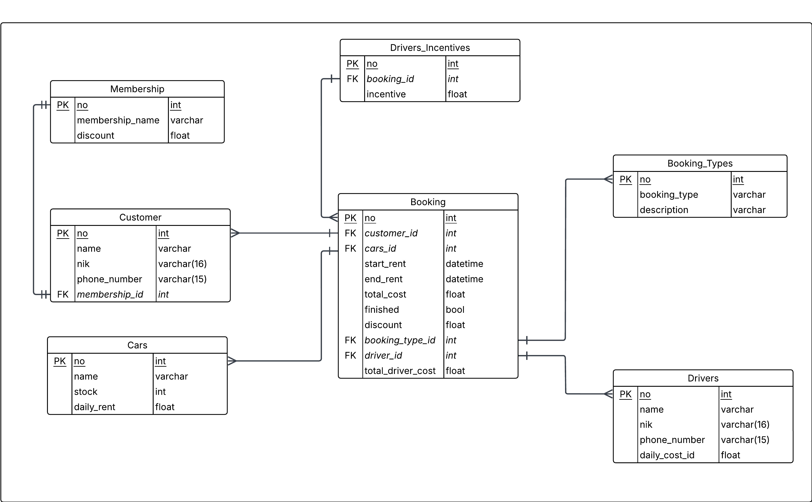

# Car Rental API

A comprehensive Go-based car rental management system API built using Gin framework with PostgreSQL database. Features advanced booking management, membership system with discounts, driver services, and automatic stock management.

The API is available in two versions:
- **API v1 (Legacy)**: Basic CRUD operations for cars, customers, and bookings with hard delete functionality
- **API v2 (Current)**: Enhanced API with soft delete functionality, membership system, driver management, booking types, and advanced features

## Documentation

> **⚡ Quick Access**: **[Complete API Documentation](docs/api-documentation.md)** 
> 
> Comprehensive documentation with examples, validation rules, business logic, and all endpoint details for both API versions.
>
> **🧪 API Testing**: **[API v1 Postman Collection](docs/car-rental-v1.postman_collection.json)** | **[API v2 Postman Collection](docs/car-rental-v2.postman_collection.json)**

## 📑 Table of Contents

- [🚀 Quick Start](#🚀-quick-start)
- [📋 API Endpoints](#📋-api-endpoints)
- [✨ Key Features](#✨-key-features)
- [🗄️ Database Schema](#️🗄️-database-schema)
- [⚙️ Technology Stack](#️⚙️-technology-stack)
- [📁 Project Structure](#📁-project-structure)

## 🚀 Quick Start

### Prerequisites
- Go 1.23.1 or higher
- PostgreSQL database

### Installation

1. Clone the repository
2. Install dependencies:
```bash
go mod download
```

3. Set up environment variables:
```bash
# Database Configuration
DB_HOST=localhost          # Default: localhost
DB_PORT=5432              # Default: 5432
DB_USER=postgres          # Default: postgres
DB_PASSWORD=your_password # Required
DB_NAME=car_rental        # Default: car_rental
DB_SSLMODE=disable        # Default: disable

# Server Configuration
PORT=8080                 # Default: 8080
GIN_MODE=debug           # Default: debug
```

4. Run the application:
```bash
go run cmd/main.go
```

### Base URLs

The API provides two versions with different endpoints:

```
API v1 (Legacy): http://localhost:8080/api/v1
API v2 (Current): http://localhost:8080/api/v2
```

Health check endpoint: `http://localhost:8080/health`

### Production Environment

The production version of this API is deployed and available at:

```
API v1 (Legacy): https://car-rental-production-03b7.up.railway.app/api/v1
API v2 (Current): https://car-rental-production-03b7.up.railway.app/api/v2
```

## 📋 API Endpoints

The API is available in two versions:
- **API v1 (Legacy)**: Basic CRUD operations for cars, customers, and bookings with hard delete functionality
- **API v2 (Current)**: Enhanced API with soft delete functionality, membership system, driver management, booking types, and advanced features

### Health Check
- `GET /health` - API status check

### Customer Management
#### API v1
- `GET /api/v1/customers` - List all customers
- `GET /api/v1/customers/:id` - Get customer by ID
- `POST /api/v1/customers` - Create new customer
- `PUT /api/v1/customers/:id` - Update customer information
- `DELETE /api/v1/customers/:id` - Hard delete customer

#### API v2
- `GET /api/v2/customers` - List all customers with membership details
- `GET /api/v2/customers/:id` - Get customer by ID with membership information
- `POST /api/v2/customers` - Create new customer
- `PUT /api/v2/customers/:id` - Update customer information
- `DELETE /api/v2/customers/:id` - Soft delete customer
- `PUT /api/v2/customers/:id/subscribe/:membership_id` - Subscribe customer to membership
- `DELETE /api/v2/customers/:id/unsubscribe` - Remove customer membership

### Car Management
#### API v1
- `GET /api/v1/cars` - List all cars
- `GET /api/v1/cars/:id` - Get car by ID
- `POST /api/v1/cars` - Create new car
- `PUT /api/v1/cars/:id` - Update car
- `DELETE /api/v1/cars/:id` - Hard delete car

#### API v2
- `GET /api/v2/cars` - List all cars
- `GET /api/v2/cars/:id` - Get car by ID
- `POST /api/v2/cars` - Create new car
- `PUT /api/v2/cars/:id` - Update car
- `DELETE /api/v2/cars/:id` - Soft delete car

### Booking Management
#### API v1
- `GET /api/v1/bookings` - List all bookings with customer and car details
- `GET /api/v1/bookings/:id` - Get booking by ID
- `POST /api/v1/bookings` - Create new booking
- `PUT /api/v1/bookings/:id` - Update booking
- `DELETE /api/v1/bookings/:id` - Delete booking (restores car stock)
- `PUT /api/v1/bookings/:id/finish` - Mark booking as finished

#### API v2
- `GET /api/v2/bookings` - List all bookings with complete details (customer, car, driver, booking type)
- `GET /api/v2/bookings/:id` - Get booking by ID
- `POST /api/v2/bookings` - Create new booking with booking type and optional driver
- `PUT /api/v2/bookings/:id` - Update booking
- `DELETE /api/v2/bookings/:id` - Delete booking (restores car stock)
- `PUT /api/v2/bookings/:id/finish` - Mark booking as finished
- `GET /api/v2/bookings/types` - List all booking types (Car Only, Car & Driver)
- `GET /api/v2/bookings/types/:id` - Get specific booking type

### Membership Management (API v2 Only, Read-Only)
- `GET /api/v2/memberships` - List all available memberships
- `GET /api/v2/memberships/:id` - Get membership details with discount information

### Driver Management (API v2 Only)
- `GET /api/v2/drivers` - List all drivers with availability status
- `GET /api/v2/drivers/:id` - Get driver by ID
- `POST /api/v2/drivers` - Create new driver
- `PUT /api/v2/drivers/:id` - Update driver
- `DELETE /api/v2/drivers/:id` - Soft delete driver
- `GET /api/v2/drivers/:id/incentives` - Get driver incentive history

## ✨ Key Features

### Core Features (Both API Versions)
- **📦 Automatic Stock Management**: Car inventory automatically updated on booking operations
- **💰 Basic Cost Calculation**: Total costs computed with rental duration and daily rates
- **✅ Validation**: Input validation with detailed error messages
- **🔗 Relationship Management**: Comprehensive foreign key handling and referential integrity

### Enhanced Features (API v2 Only)
- **🏷️ Membership System**: Customer membership with automatic discount calculation
- **🚗 Driver Services**: Car & Driver booking options with driver cost calculation
- **🔄 Booking Types**: Support for "Car Only" and "Car & Driver" booking types
- **💾 Soft Delete**: Preserves historical data while hiding deleted records from queries
- **⛔ Advanced Constraints**: Additional referential integrity checks and business rules
- **📊 Enhanced Error Responses**: Constraint-based validation with detailed structured errors
- **💰 Advanced Cost Calculation**: Automatic discount application and driver cost integration

<details>
<summary><strong>📋 Detailed Features & Business Logic</strong></summary>

### Core Features (API v1 & v2)

**Stock Management**
- Car inventory automatically decremented on booking creation
- Stock restored on booking deletion or completion
- Prevents overbooking with availability checking

**Basic Cost Calculation**
- Base cost: (rental days) × (car daily rent)
- No automatic discounts in API v1

**Basic Validation & Constraints**
- Customer and car existence validation
- Car availability checking (stock > 0)
- Date validation (start date cannot be in past, must be before end date)
- Booking modification restrictions (cannot modify finished bookings)
- NIK uniqueness and format validation (16 characters)
- Phone number format validation (max 15 characters)

### Advanced Features (API v2 Only)

**Enhanced Cost Calculation**
- Membership discounts automatically applied
- Driver costs calculated and added for Car & Driver bookings
- Total cost includes all applicable fees and discounts

**Soft Delete**
- Preserves historical data for customers, cars, and drivers
- Maintains referential integrity while hiding deleted records
- Constraint-based deletion with detailed error responses

**Membership Integration**
- Customers can subscribe/unsubscribe to memberships
- Automatic discount application during booking cost calculation
- Membership details included in customer and booking responses

**Driver Assignment**
- Optional driver assignment for Car & Driver bookings
- Driver incentive history tracking
- Separate cost calculation for driver services

**Booking Types**
- Support for different booking types (Car Only, Car & Driver)
- Validation rules specific to booking type (e.g., driver required for Car & Driver)

</details>

## 🗄️ Database Schema

### Current Schema (API v2)


### Legacy Schema (API v1)


<details>
<summary><strong>🗄️ Database Structure</strong></summary>

### Customer Table
- **no** (PK) - `int` - Primary key, unique customer identifier
- **name** - `varchar` - Customer's full name (required)
- **nik** - `varchar(16)` - National identification number (required, unique, 16 chars)
- **phone_number** - `varchar(15)` - Customer's contact phone number (required, max 15 chars)
- **membership_id** (FK) - `int` - Foreign key referencing Membership.no (optional)

### Cars Table
- **no** (PK) - `int` - Primary key, unique car identifier
- **name** - `varchar` - Car model/name (required)
- **stock** - `int` - Number of available cars of this model (required, min 0)
- **daily_rent** - `float` - Daily rental price (required, min 0)

### Booking Table
- **no** (PK) - `int` - Primary key, unique booking identifier
- **customer_id** (FK) - `int` - Foreign key referencing Customer.no (required)
- **cars_id** (FK) - `int` - Foreign key referencing Cars.no (required)
- **start_rent** - `datetime` - Rental start date and time (required)
- **end_rent** - `datetime` - Rental end date and time (required)
- **total_cost** - `float` - Total calculated cost for the rental period
- **finished** - `bool` - Flag indicating if the rental is completed (default: false)
- **discount** - `float` - Applied discount amount (default: 0)
- **booking_type_id** (FK) - `int` - Foreign key referencing BookingType.no (required)
- **driver_id** (FK) - `int` - Foreign key referencing Driver.no (optional)
- **total_driver_cost** - `float` - Total driver cost (default: 0)

### Membership Table
- **no** (PK) - `int` - Primary key, unique membership identifier
- **membership_name** - `varchar` - Name of the membership tier (required)
- **discount** - `float` - Discount percentage offered by membership (required)

### Driver Table
- **no** (PK) - `int` - Primary key, unique driver identifier
- **name** - `varchar` - Driver's full name (required)
- **nik** - `varchar(16)` - National identification number (required, unique)
- **phone_number** - `varchar(15)` - Driver's contact phone number (required)
- **license_number** - `varchar` - Driver's license number (required, unique)
- **daily_rate** - `float` - Daily rate for driver services (required)
- **available** - `bool` - Driver availability status (default: true)

### BookingType Table
- **no** (PK) - `int` - Primary key, unique booking type identifier
- **name** - `varchar` - Type name (e.g., "Car Only", "Car & Driver")
- **description** - `varchar` - Description of the booking type

### DriverIncentive Table
- **no** (PK) - `int` - Primary key, unique incentive identifier
- **driver_id** (FK) - `int` - Foreign key referencing Driver.no (required)
- **amount** - `float` - Incentive amount (required)
- **date** - `datetime` - Date when incentive was awarded (required)
- **description** - `varchar` - Description of the incentive reason

### Relationships
1. **Customer → Booking**: One-to-Many (A customer can have multiple bookings)
2. **Customer → Membership**: Many-to-One (Multiple customers can have the same membership)
3. **Cars → Booking**: One-to-Many (A car model can be booked multiple times)
4. **Driver → Booking**: One-to-Many (A driver can be assigned to multiple bookings)
5. **Driver → DriverIncentive**: One-to-Many (A driver can have multiple incentives)
6. **BookingType → Booking**: One-to-Many (A booking type can be used for multiple bookings)

</details>

## ⚙️ Technology Stack

- **Framework**: [Gin](https://gin-gonic.com/) - HTTP web framework
- **Database**: PostgreSQL with [GORM](https://gorm.io/) ORM
- **Environment**: [godotenv](https://github.com/joho/godotenv) for configuration
- **Language**: Go 1.23.1

## 📁 Project Structure

```
car-rental-2/
├── cmd/
│   └── main.go              # Application entry point
├── pkg/
│   ├── database/            # Database connection and seeding
│   │   ├── database.go      # Database configuration and connection
│   │   └── seed.go          # Database seeding with initial data
│   ├── handlers/            # HTTP request handlers
│   │   ├── customer.go      # Customer CRUD + membership operations (v1, v2)
│   │   ├── car.go          # Car CRUD operations (v1, v2)
│   │   ├── booking.go      # Booking CRUD + finish operations (v1, v2)
│   │   ├── membership.go   # Membership read operations (v2 only)
│   │   ├── driver.go       # Driver CRUD + incentive operations (v2 only)
│   │   └── booking_type.go # Booking type read operations (v2 only)
│   ├── models/              # Data models and validation
│   │   ├── customer.go     # Customer model
│   │   ├── car.go         # Car model
│   │   ├── booking.go     # Booking model
│   │   ├── membership.go  # Membership model (v2 only)
│   │   ├── driver.go      # Driver model (v2 only)
│   │   ├── driver_incentive.go # Driver incentive model (v2 only)
│   │   └── booking_type.go # Booking type model (v2 only)
│   ├── routes/              # API route definitions
│   │   └── routes.go       # Routes for both v1 and v2 endpoints
│   └── utils/               # Utility functions
│       └── referential_integrity.go # Database constraint utilities
├── docs/
│   ├── erd-v1.jpeg         # Original Entity Relationship Diagram (API v1)
│   ├── erd-v2.jpeg         # Updated Entity Relationship Diagram (API v2)
│   ├── api-documentation.md # Complete API documentation for both versions
│   ├── car-rental-v1.postman_collection.json # Postman collection for API v1
│   └── car-rental-v2.postman_collection.json # Postman collection for API v2
├── bin/
│   └── car-rental.exe      # Compiled binary
├── go.mod                  # Go module dependencies
├── go.sum                  # Dependency checksums
└── README.md
```